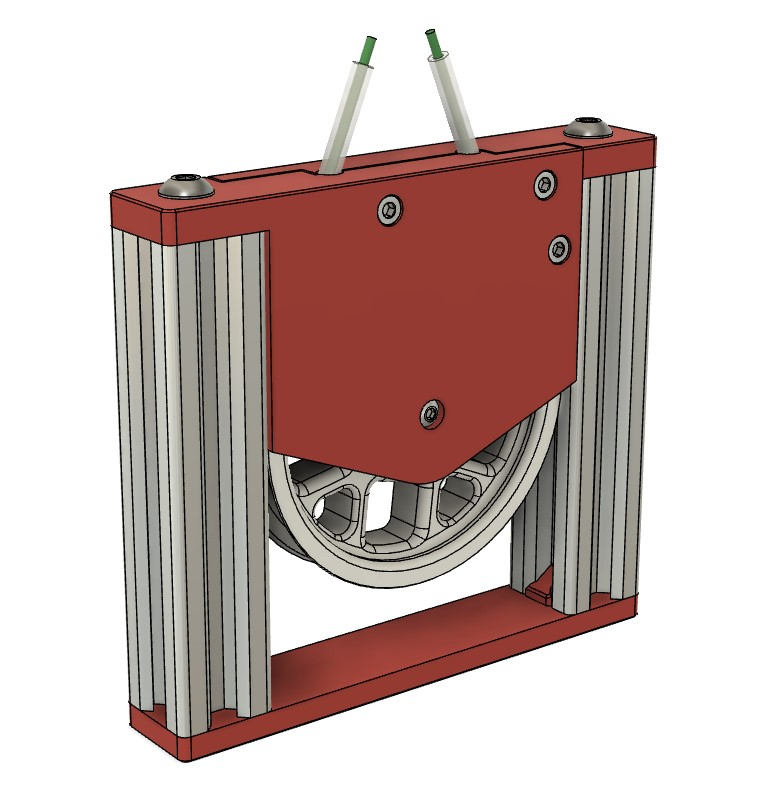
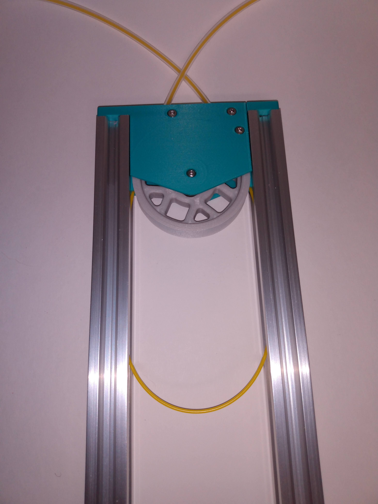
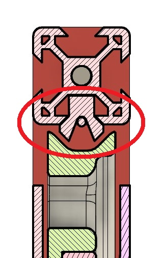
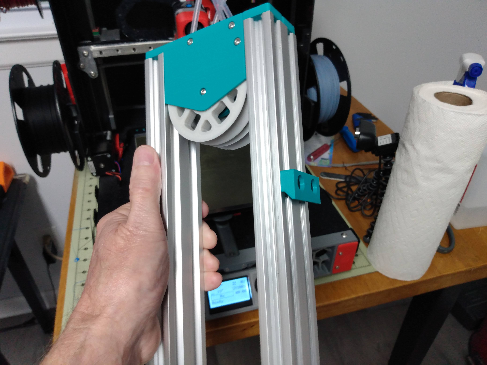
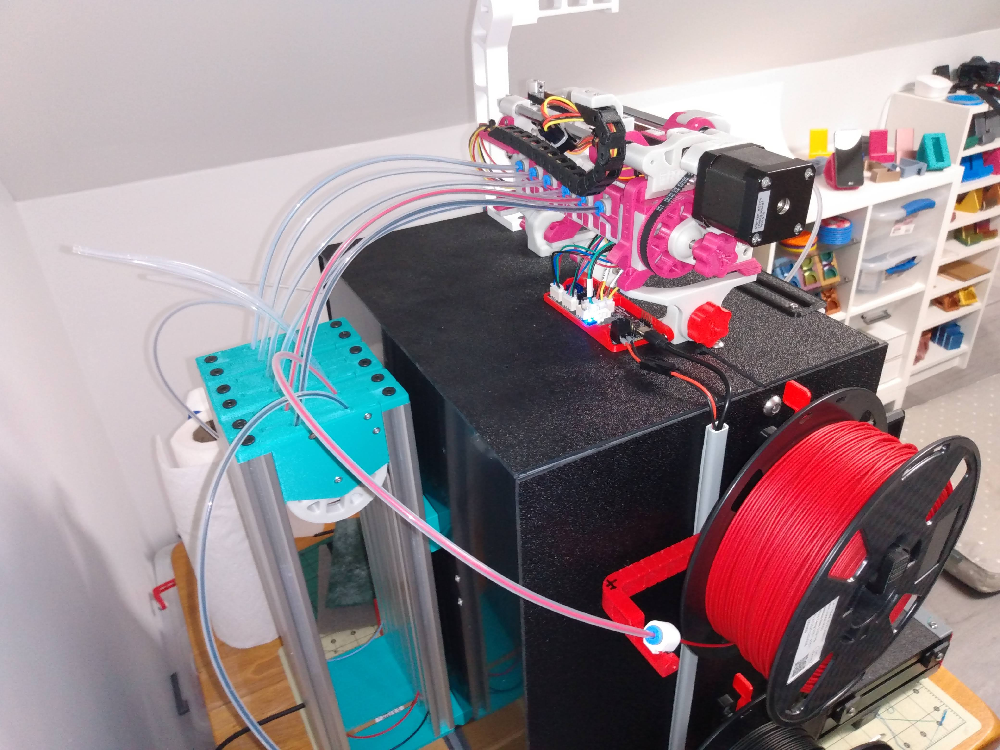
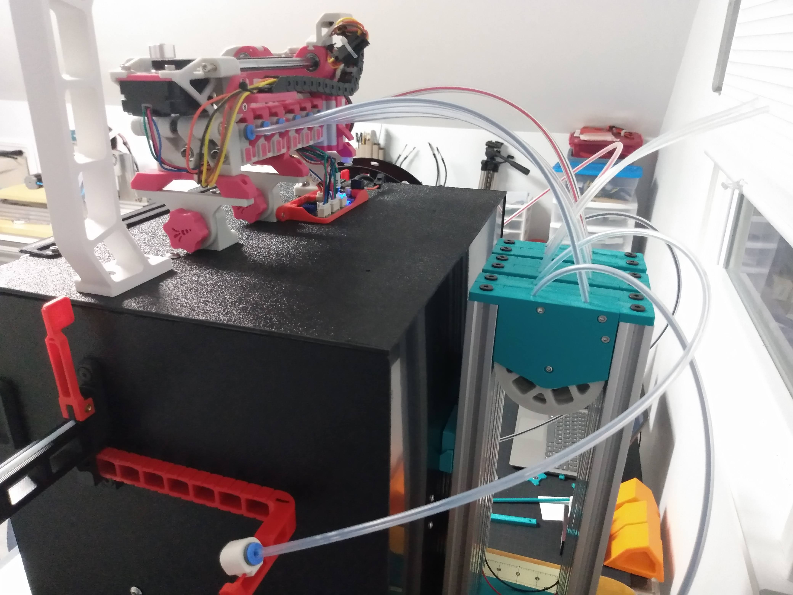
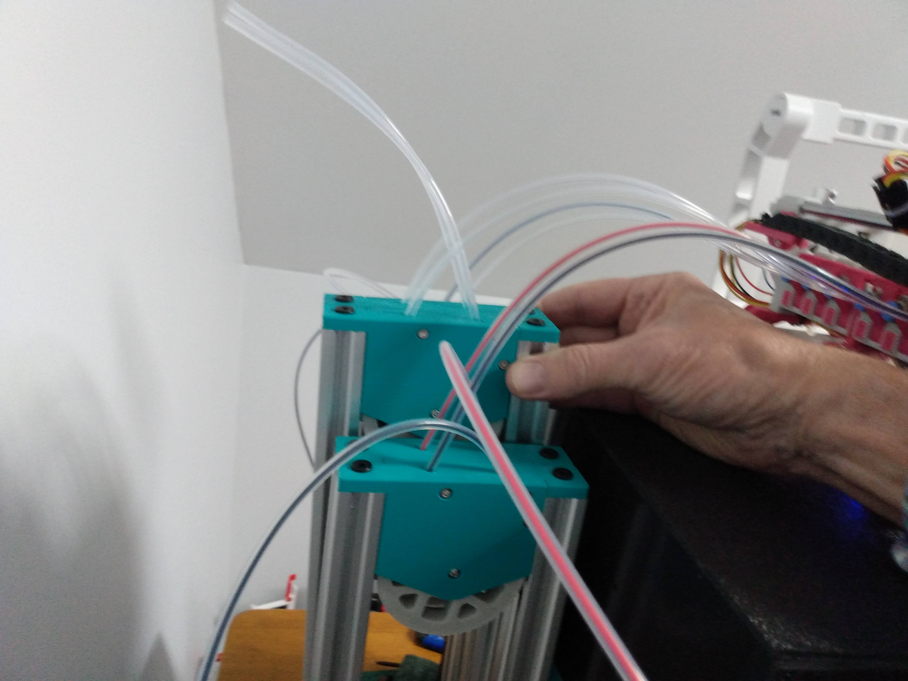

# Metal Buffer (for ERCF or other MMU)

This is a single-loop buffer that utilizes aluminum extrusion to constrain the filament within the buffer.  It is designed around Openbuilds V-slot extrusion because I had tons of it around.  It also uses the buffer wheel and bearing from the Enraged Rabbit Carrot Feeder project.

The design could probably be modified to work with other 20x20 extrusion, but it would not be a trivial task.  The slot in the top wheel assembly depends on the extra space made available by the "V" slot.  Additionally, the tapered slot provides a natural guide for the filament once it leaves the printed wheel assembly.

For you ERCF users, V-slot is available in 20x60 (enough for 3 buffers) for about $20/meter. And the spacing almost exactly matches the tool spacing of the ERCF. (It's also available in 20x40 and 20x80.) Here is an example of two buffers mounted in 20x40:

## Determine Extrusion Length

To determine the length of the extrusion required (in mm) use the formula:

**BufferLength/2 + 65** (65mm is the space used by the wheel assembly.)

To determine "BufferLength" for ERCF: add the length of the bowden tube,  the distance from the bottom of bowden tube to the nozzle, and the distance from the top of the bowden tube to the magnetic gate (35mm). Note: configured bowden to nozzle distance may not include distance between extruder gears and bowden.

For example, I'm using ERCF on a Switchwire with an LGX.  My bowden tube is 425mm,  my configured bowden-to-nozzle distance is 82mm (I allowed an additional 8mm for bowden to gears).  So "BufferLength" for me was 425 + 90 + 35 = 550.  Doing the calculations above, my requied extrusion length turned out to be 340mm.  Just to be safe, I cut my extrusions to 350mm.

## BOM (for a single buffer)
 - (2) [V-slot aluminum extrusion of required length](https://openbuildspartstore.com/v-slot-linear-rail-1/)
 - (8) M3 x 5mm x 4mm heat-set insert
 - (4) M3 x 8mm SHCS
 - (2) M3 x 10mm SHCS
 - (1) M3 x 6mm BHCS
 - (1) M3 x 8mm BHCS
 - (2) M5 x 6mm BHCS (or self-tapping screws below)
 - (2) M5 x 10mm BHCS (or self-tapping screws below)
 - (2) 2.5mm ID x 4.0mm OD PTFE tubes (of appropriate length)
 - (1) 608ZZ Bearing (from ERCP)

### (optional)
 - M5 x 0.80 tapping tool
 - (4) [#10 x 3/4" Self-Tapping Screws](https://openbuildspartstore.com/self-tapping-screw/) (in case you don't like tapping)
 
**Note 1:** You can use a bit longer screws (1-2mm) than shown **except** for the M3 BHCS (axle screws).

**Note 2:** The top assembly *clamps* the PTFE tubing in place. Use of less than 2.5mm ID risks "choking" the filament.

## Directions

Print the parts using standard Voron settings (40% infill, 0.2 layerheight, 0.4 forced extrusion width) out of ABS or ASA.

The Documentation folder contains the [assembly instructions](./Documentation/MBuffer-Assembly.pdf).

## Loading the Buffer

The top of the buffer assembly can be removed for loading if required.  Depending on how you mount your array of buffers, the buffer can be loaded without removing the top.

## Metal Buffer on Switchwire with 6-cart ERCF

Enjoy!