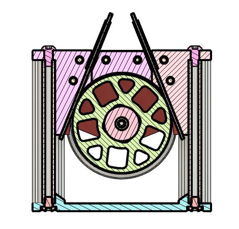
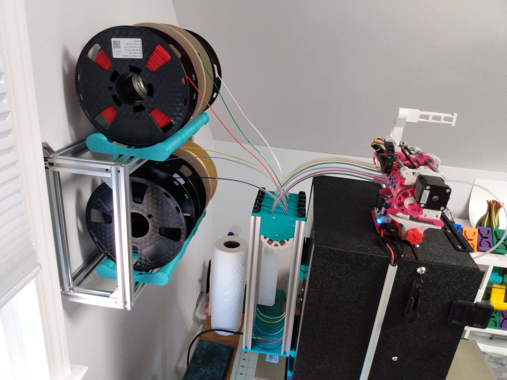
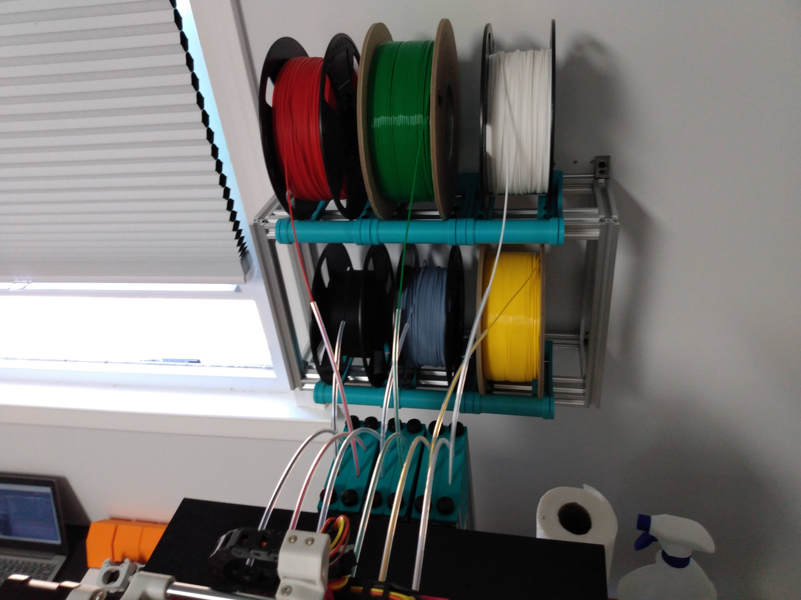

# Metal Buffer (for ERCF or other MMU)

This is a single-loop buffer that utilizes aluminum extrusion to constrain the filament within the buffer.  It is designed around Openbuilds V-slot extrusion because I had tons of it around.  It also uses the buffer wheel and bearing from the Enraged Rabbit Carrot Feeder project.

The design could probably be modified to work with other 20x20 extrusion, but it would not be a trivial task.  The slot in the top wheel assembly depends on the extra space made available by the "V" slot.  Additionally, the tapered slot provides a natural guide for the filament once it leaves the printed wheel assembly.

For you ERCF users, V-slot is available in 20x60 (enough for 3 buffers) for about $20/meter. And the spacing almost exactly matches the tool spacing of the ERCF. (It's also available in 20x40 and 20x80.) Here is an example of two buffers mounted in 20x40:

## Determine Extrusion Length

To determine the length of the extrusion required (in mm) use the formula:

**BufferLength/2 + 65** (65mm is the space used by the wheel assembly.)

To determine "BufferLength" for ERCF: add the length of the bowden tube,  the distance from the bottom of bowden tube to the nozzle, and the distance from the top of the bowden tube to the magnetic gate (35mm). Note: configured bowden to nozzle distance may not include distance between extruder gears and bowden.

For example, I'm using ERCF on a Switchwire with an LGX.  My bowden tube is 425mm,  my configured bowden-to-nozzle distance is 82mm (I allowed an additional 8mm for bowden to gears).  So "BufferLength" for me was 425 + 90 + 35 = 550.  Doing the calculations above, my requied extrusion length turned out to be 340mm.  Just to be safe, I cut my extrusions to 350mm.

## BOM (for a single buffer)
 - (2) [V-slot aluminum extrusion of required length](https://openbuildspartstore.com/v-slot-linear-rail-1/)
 - (8) M3 x 5mm x 4mm heat-set insert
 - (4) M3 x 8mm SHCS
 - (2) M3 x 10mm SHCS
 - (1) M3 x 6mm BHCS
 - (1) M3 x 8mm BHCS
 - (2) M5 x 6mm BHCS (or self-tapping screws below)
 - (2) M5 x 10mm BHCS (or thumbscrews or self-tapping screws below)
 - (2) 2.5mm ID x 4.0mm OD PTFE tubes (of appropriate length)
 - (1) 608ZZ Bearing (from ERCP)

### (options)
 - M5 x 0.80 tapping tool (for tapping extrusion)
 - (2) M5 x 10mm x 16mm diam thumbscrews [on amazon](https://www.amazon.com/dp/B07KFV6HW8/) (must be tapped with tool)
 - (4) [#10 x 3/4" Self-Tapping Screws](https://openbuildspartstore.com/self-tapping-screw/) (in case you don't like tapping)
 
**Note 1:** You can use a bit longer screws (1-2mm) than shown **except** for the M3 BHCS (axle screws).

**Note 2:** The top assembly *clamps* the PTFE tubing in place. Use of less than 2.5mm ID risks "choking" the filament.

## Directions

Print the parts using standard Voron settings (40% infill, 0.2 layerheight, 0.4 forced extrusion width) out of ABS or ASA.

The Documentation folder contains the [assembly instructions](./Documentation/MBuffer-Assembly.pdf).

## Loading the Buffer

The top of the buffer assembly can be removed for loading if required.  Depending on how you mount your array of buffers, the buffer can be loaded without removing the top.

Here are three modules, each with two buffers mounted in 20x40 extrusion. Each module will stay together even with one top removed for loading.  However, I usually load without removing a top (or even lifting a module - I can reach to the middle of my array easily enough).

## How it works and mounting recommendations/caveats (example: MBuffer on Switchwire with 6-cart ERCF)

The filament paths in the buffer's top-assembly are actually straight (as shown in the cross-section). This forces the filament to the extrusion during unloading. Ideally, the resulting tension causes the filament to stay in both extrusions during the load and unload.

However, excessive "twisting" of the filament (from elsewhere in the system) can cause the filament to pop out of the extrusion.  Therefore positioning the buffer in order to reduce filament twist is essential.  Ideally you want the buffer assembly to be mounted directly behind the ERCF with each buffer aligned with one of the carts.  Even better if you can have your spools mounted behind the buffers.

Here is my current mounting on Switchwire.

I originally had my spools routed to the buffers from the sides, but never did have problems with popping filament.  But I am only buffering ~600mm of filament.  A V2 buffering 1100-1200mm will require more care.  Thanks to garbqgebag on discord for beta-testing this design with a V2 and pointing out the importance of mounting position.  See our discussion on the Voron discord: https://discord.com/channels/460117602945990666/909743915475816458/1039285958933225603

### And finally, Metal Buffer in action!

https://user-images.githubusercontent.com/12124123/196645301-cd481165-e586-41fb-b28d-ce4f89cd5ee8.mp4

Enjoy!
